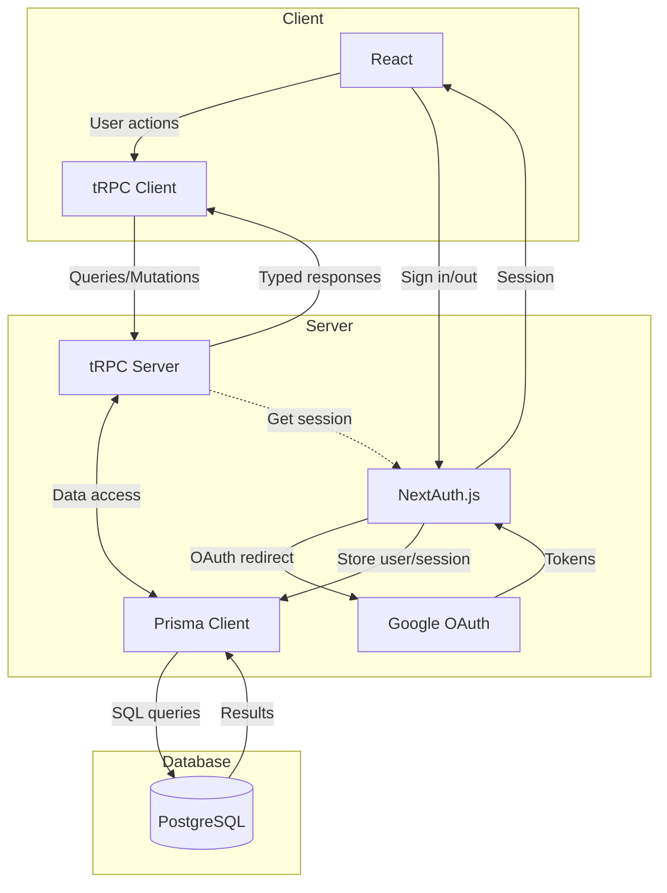

```mermaid
flowchart TB
    subgraph Client
        React["React"]
        TRPCClient["tRPC Client"]
    end

    subgraph Server
        TRPCServer["tRPC Server"]
        NextAuth["NextAuth.js"]
        GoogleOAuth["Google OAuth"]
        Prisma["Prisma Client"]
    end

    subgraph Database
        DB[(PostgreSQL)]
    end

    React -->|"User actions"| TRPCClient
    TRPCClient -->|"Queries/Mutations"| TRPCServer
    TRPCServer -->|"Typed responses"| TRPCClient

    React -->|"Sign in/out"| NextAuth
    NextAuth -->|"Session"| React

    TRPCServer <-->|"Data access"| Prisma
    TRPCServer -.->|"Get session"| NextAuth

    NextAuth -->|"OAuth redirect"| GoogleOAuth
    GoogleOAuth -->|"Tokens"| NextAuth
    NextAuth -->|"Store user/session"| Prisma

    Prisma -->|"SQL queries"| DB
    DB -->|"Results"| Prisma
```